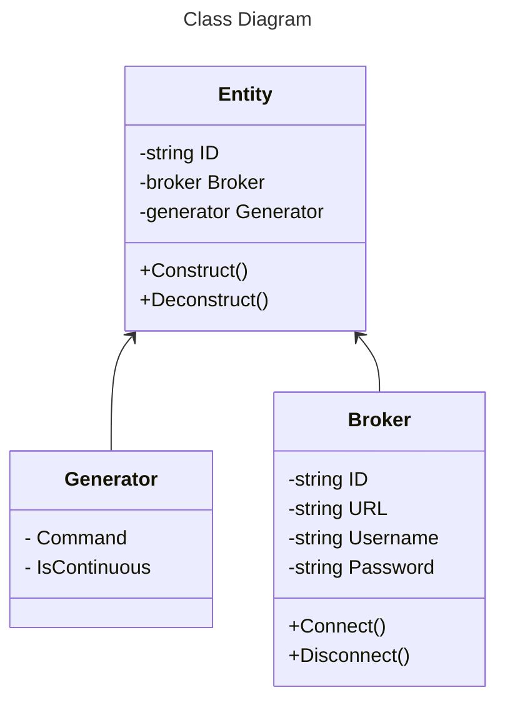

# Config Layout

See [schema](config.schema.json), and test UI in [UI Schema](https://ui-schema.bemit.codes/examples/Main-Demo).

# Class Diagram

# Default Values

Some fields will have default wrappers/values

## Availability

In all cases, it will be made `off` when disconnecting.
If no generator is given, it will be made `on` when connecting.
If a generator is given, we will use that to start, but still ensure it is `off` when shutting down.

The use-case for a custom function will be for advanced configs like, for example, a hard drive, which may or may not be plugged in.
